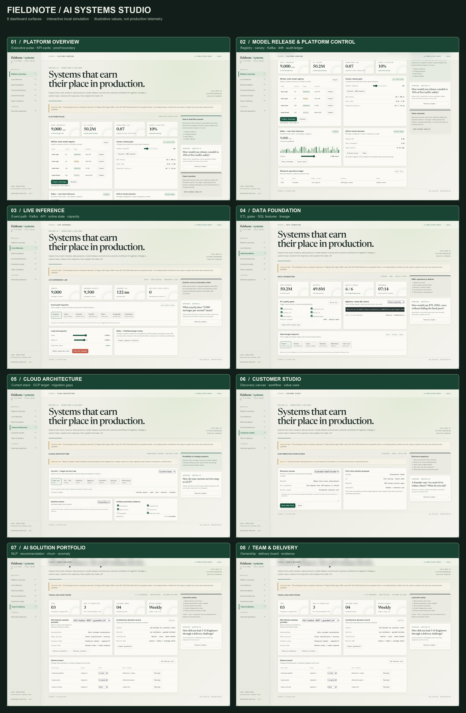
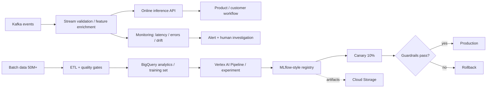

# AI Platform Interview Lab

An interactive, local-first demo workspace for learning and defending the AI/ML platform experience described in the interview brief.

## Open it

On Windows, double-click `start.bat`. It starts a local Python server and opens the dashboard at `http://127.0.0.1:8080/ai-platform-interview-lab/index.html`; keep the server window open while using it and press Ctrl+C there to stop. No API or package install is needed if Python 3 is already installed. Google Fonts is optional; system font fallbacks work offline. Live-looking metrics and simulator outcomes are illustrative, not telemetry.

## Dashboard preview

Captured from eight screens of the local interactive demo. Open the image at full size to inspect each screen. Values shown are illustrative simulation state, not production telemetry.

### Read each screen clearly

The overview above is a quick tour. Open any full-size screenshot below to read the dashboard details; the first two tour frames are separate sections within Platform overview.

| Dashboard screen | Full-size capture |
| --- | --- |
| Platform overview · executive pulse and model release | [Open screenshot](docs/screens/01-platform-overview.png) |
| Live inference · event flow, load and capacity | [Open screenshot](docs/screens/02-live-inference.png) |
| Data foundation · ETL, quality gates and features | [Open screenshot](docs/screens/03-data-foundation.png) |
| Cloud architecture · services and migration map | [Open screenshot](docs/screens/04-cloud-architecture.png) |
| Customer studio · discovery and solution brief | [Open screenshot](docs/screens/05-customer-studio.png) |
| Team & delivery · ownership and execution | [Open screenshot](docs/screens/06-team-delivery.png) |

GitHub scales screenshots to fit the page. Click **Open screenshot** to view each capture at its original 1894 × 1244 resolution. The 8-frame tour splits Platform overview into its executive pulse and lower platform-control panels; both are visible in the full-size overview capture.

## Demo areas

- **Model lifecycle:** MLflow-style registry stages (`Staging → Production → Archived`), promote gates, compare versions, and rollback.
- **Safe release:** route 10% traffic to a canary, simulate outcomes, inspect error/latency/quality gates, and roll back when a guardrail fails.
- **Streaming:** Kafka event pipeline with adjustable incoming rate up to 9,000 messages/second, pause/resume, consumer lag, and injected drift.
- **Data quality / ETL:** 50M+ record batch, configurable checks, quarantine counts, feature generation, and a BigQuery-ready SQL window-function example.
- **Cloud architecture:** inspect services and map Kafka→Pub/Sub, MLflow artifacts→Cloud Storage, API serving→Cloud Run/GKE, and batch SQL→BigQuery / Vertex AI Pipelines.
- **Customer solutioning:** interactive discovery notes, requirements, proposed architecture, demo plan, and business outcome framing.
- **Leadership & IGA portfolio:** switch between real-time NLP, recommendation, churn and anomaly-detection case studies; review team decisions and customer/demo artifacts.
- **Interview mode:** launch any of 30 ranked prompts from the relevant panel, or open the full list via [INTERVIEW_GUIDE.md](INTERVIEW_GUIDE.md). The questions deliberately probe measurement, failure behavior, business outcomes and ownership.

## Truth boundary

The UI is a **simulation of interview scenarios**, not a deployed production system. It contains no real user, customer, business, or model telemetry. Figures such as 9,000 msg/s, 50M+ records, churn AUC 0.87 and 94% anomaly detection are shown as claims from the supplied interview brief; they are not independently verified in this repo. The demo lets you explain how you would validate those claims and design the production controls around them.

## Interview practice

Start with [INTERVIEW_GUIDE.md](INTERVIEW_GUIDE.md). It contains 30 ranked open-ended questions. Answer one numbered question in chat at a time. I will score it from 0–4, identify what is correct or missing, ask a probing follow-up, then advance only when your explanation is solid. The questions cover business framing, data/ETL, features and leakage, model quality, online architecture, MLOps, cloud migration, customer discovery, leadership and incident response.

## Architecture represented

## Important interview distinction

Keep **what you personally built**, **what the team built**, **what you designed for migration**, and **what the demo simulates** separate. For example, “Kafka pipeline served a measured 9,000 msg/s” is a different claim from “the design is ready to adapt to Pub/Sub.” The interview guide will ask you to defend measurement method, workload shape, error budget and migration work.
